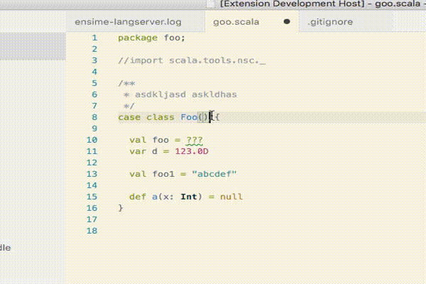

[](https://travis-ci.org/dragos/dragos-vscode-scala)

# Scala language server for VS Code




This is an experiment for building a Language Server for Scala, in Scala.

- language server: A Scala-based implementation of the [language server protocol](https://github.com/Microsoft/language-server-protocol/blob/master/protocol.md)
- scala: A Typescript-based Scala extension (language client). Ideally it will be ported to Scala.js
- ensime-lsp: An implementation of the Language Server based on Ensime

The language server may be backed up by [ensime](http://ensime.github.io/) or directly by the presentation compiler. Ideally, the language server can be used as a basis for implementing support for any language, not just Scala.

# How to try it out

> UPDATE: The extension is published to Marketplace. You can still use the instructions below to start contributing.

Download an existing [release](https://github.com/dragos/dragos-vscode-scala/releases) and install it in Code by choosing `Install from VSIX` in the Extensions view.

Make sure you have an existing `.ensime` file before starting code in that directory (`sbt ensimeConfig` should create it if you have [sbt-ensime](https://github.com/ensime/ensime-sbt) already setup)

### What works

- errors as you type
- code completion
- goto definition (F12 and CMD-F12)
- hover
- file structure (definitions)

## Building

tl;dr

```bash
$ sbt publishLocal
$ cd scala
$ npm install # only the first time, to download dependencies
$ npm install -g vsce typescript # if you don't have Typescript installed globally
$ vsce package
```

You should see a file `ensime-scala-0.0.4.vsix` (or whatever version you are building). Now install it in Code by choosing `Install from VSIX` in the Extensions view.


The root Sbt project controls all the Scala parts of the build. The client is written in Typescript (it's really minimal) and lives under scala/. This one is built using Code's tools.

- languageserver/ contains the language-independent server implementation. It does not implement the full protocol yet. Features are added by-need, when the reference implementation in ensime-lsp/ needs it
- ensime-lsp/ implements an Ensime based Scala language server
- scala/ The typescript extension (eventually should migrate to Scala.js)

`ensime-lsp` is what you will want to build most of the times. It's launched with coursier by the client, for it to be as simply as possible.

You should use `sbt publishLocal` which publishes the server under `~/.ivy2/local`, so the client finds it easily.

## Running

You can open code inside the `scala/` directory and use `F5` to debug the extension. This picks up the changes in the server (make sure you published it locally using `sbt publishLocal`!) and allows quick iteration.

## Settings

If VSCode is running behind a proxy add the following standard VSCode proxy settings (File -> Preferences -> Settings):

{
    "http.proxy": "http://host:port/"
}

This setting is translated as Coursier's vm arguments: -Dhttp.proxyHost=host -Dhttps.proxyHost=host -Dhttp.proxyPort=port -Dhttps.proxyPort=port.

Log level settting:
{
    "scalaLanguageServer.logLevel" : "DEBUG"
}

This setting is passed to the Language Server affecting the log leven on the server, possible values "DEBUG", "ERROR", "INFO", "WARN"


# Publish

```
> publishSigned
> sonatypeRelease
```

Then `cd scala/` and run `vsce publish`
